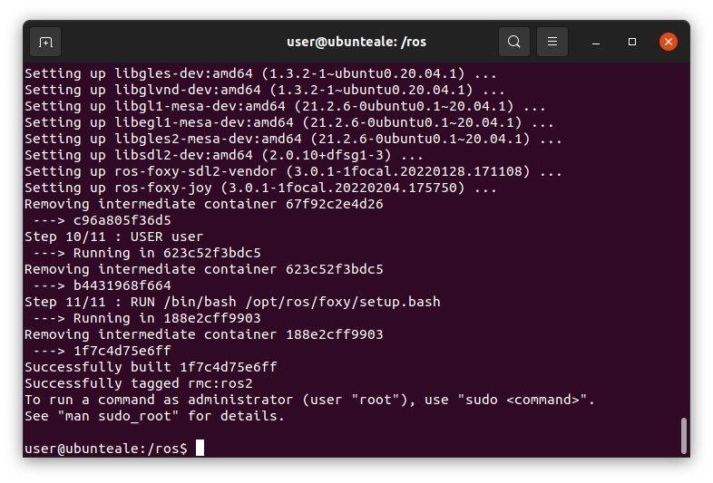

# CSULB's ROS code repository for Nasa Lunabotics

This repo contains all of the needed files in order to start and run the rover.  The rover uses an ARM based processor on board to process autonomy and run the teleop code.

The rover is programmed with a system called ROS (Robot Operating System). Specifically we are using ROS2, Foxy Fitzroy release. If you wish to learn more about what ROS is, I suggest you checkout their website [here](https://www.ros.org/).

Our ROS packages, located in the `dev_ws/src/` folder, contain the code needed in order to run the rover in teleop and autonomous mode.

Because ROS can be a bit of a pain to setup, we utilize [Docker](https://www.docker.com/) to automate creating an environment where we can run our code.

## What is Docker?

Docker is a system used for managing "containers", that is, environments completely isolated from your main operating system that can run it's own operating system.  Although it's a bit more complex, you can think of a docker container like a tiny Virtual Machine, where the only way you can communicate it is through terminal.  If you want a more in depth explanation of exactly how Docker works behind the scenes, I recommend you check out [here](https://docs.docker.com/get-started/overview/).

## How do we use Docker?

We use docker in this project to setup ROS automatically for us.  The [`docker/Dockerfile`](docker/Dockerfile) file contains the configuration we use for setting up our docker container.

While most of the configuration is done by [ROS's official docker images](https://hub.docker.com/_/ros/), which is what we use as a base, we do make a few modifications to it.  Namely, we configure the user to have the same UID and GID as the host's user, that way any files created within the container can be edited like normal through external text editors or whatever you have on your system.  In addition, we also automatically install some packages which are needed for our code to run.

A script to automatically create a docker container from the Dockerfile is located at the root of this repo as [`start-docker.py`](start-docker.py).

## How do I use this repo?

In order to use this repo to create a ROS development environment or to run our ROS code, you must meet the following requirements:

### System Requirements
- Must be running a Linux based operating system (Ubuntu, Debian, Pop!_OS, Manjaro, Arch, etc...)
- Git (Instructions on how to install [here](https://www.linuxfordevices.com/tutorials/ubuntu/install-git-on-ubuntu).  Just go up to step 3.)
- Latest stable version of Docker installed.  Recommended instructions on how to do that for Ubuntu are [here](https://docs.docker.com/engine/install/ubuntu/#install-using-the-convenience-script).
- Python 3 to be able to run the docker startup script.
- (Recommended) Add your user to the docker group so you can run docker without sudo/root.  Recommended instructions [here](https://www.configserverfirewall.com/ubuntu-linux/add-user-to-docker-group-ubuntu/).
- (Optional) Some kind of gamepad/controller/joystick to be able to run/debug the teleop code.

Note: In the future, I hope to make a way for Windows users to easily use this code too, but for the time being, it's Linux only.

### Downloading the Repo

Open up the "Terminal" program, and type the following command to download the repository.

```
git clone --recursive https://github.com/CSULB-RMC/roscode-2021-2022.git
```
Then move into that directory with this command:

```
cd roscode-2021-2022
```

### Starting the Container

Now lets test running the container.  Run the following command and it should give us a terminal in the newly created container.

```
./start-docker.py
```

Note: depending on the speed of your internet/computer, this command could take a few minutes to complete.

Once the command is completed, you should have the following prompt (ending with `/ros$`) if everything was successful, as shown in the image below.  Note: you may have a lot more that was put into the terminal as output if this was your first time running that command.



## Running commands within the Container

Now that you have a ROS2 environment, you can follow along with any of the [ROS2 tutorials](http://docs.ros.org/en/foxy/Tutorials.html), or you can continue reading to try running the ROS packages we have already created.

The following section is WIP and a bit sparce.  Please contact me if you need help following along, but I will continue to update it as we go along.

### Building the Packages

Run the following:
```
cd dev_ws
colcon build
source install/setup.bash
```

Then you can run any of our nodes like so:

Teleop:
```
ros2 run rmc_teleop gamepad_control
```
### Config File
Inside this repo is the file `lbl_config.json.example`. It contains an example config used by the docker script that creates the docker image.

Currently the possible config values are:

Name | Possible Values | Description
---|---|---
`default-launch-type` | `shell`, `autonomy`, `build`, `teleop_min` | Controls what gets launched on startup. <ul><li>`shell` is just the default terminal</li><li>`autonomy` launches all of the nodes needed for full autonomy</li><li>`build` is to build and configure all of the packages</li><li>`teleop-min` launches just the micro-ros agent.</li><li>`teleop-command` launches all of the nodes including the webserver and gamepad control on the teleop command center computer.</li></ul>


### Creating a new Package

Packages should be created by creating a new git repo and adding that repo as a submodule in the `dev_ws/src` folder. Please inform me if you need to create a new repository under the CSULB-RMC organization.

**Note: for this projects all packages created should begin with the prefix "rmc_" to show that this is a package associated with the project.** Node names can be anything, however.